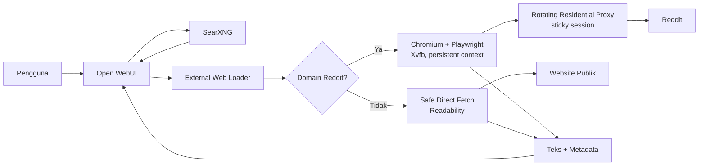

# Reddit Browser Loader untuk Open WebUI

Adapter internal agar Open WebUI yang berjalan di jaringan Indonesia dapat
mencari, membuka, dan mengambil isi Reddit secara otomatis.

Proyek ini mempertahankan alur web search Open WebUI yang sudah ada:

- SearXNG tetap digunakan untuk menemukan hasil pencarian.
- URL Reddit diproses oleh Chromium/Playwright melalui residential proxy.
- URL non-Reddit tetap diambil secara langsung tanpa memakai residential
  proxy.
- Hasil ekstraksi dikembalikan dalam format external web-loader Open WebUI
  agar dapat digunakan sebagai konteks model, RAG, dan citation.

Implementasi ini telah diuji untuk halaman subreddit, post, komentar,
redirect `redd.it`, hasil pencarian SearXNG, URL non-Reddit, restart container,
dan beberapa kontrol keamanan.

## Daftar Isi

- [Tujuan](#tujuan)
- [Latar Belakang](#latar-belakang)
- [Arsitektur](#arsitektur)
- [Cara Kerja](#cara-kerja)
- [Fitur](#fitur)
- [Struktur Repository](#struktur-repository)
- [Kebutuhan Sistem](#kebutuhan-sistem)
- [Konfigurasi Environment](#konfigurasi-environment)
- [Instalasi dan Deployment](#instalasi-dan-deployment)
- [Integrasi Open WebUI](#integrasi-open-webui)
- [API Contract](#api-contract)
- [Ekstraksi Reddit](#ekstraksi-reddit)
- [Keamanan](#keamanan)
- [Pengujian](#pengujian)
- [Operasional](#operasional)
- [Troubleshooting](#troubleshooting)
- [Backup dan Pemulihan](#backup-dan-pemulihan)
- [Resource dan Kapasitas](#resource-dan-kapasitas)
- [Temuan Eksperimen](#temuan-eksperimen)
- [Batasan](#batasan)

## Tujuan

Tujuan utama proyek ini adalah memberikan pengalaman berikut di Open WebUI:

1. Pengguna meminta model mencari pembahasan tentang suatu topik di Reddit.
2. SearXNG menemukan URL Reddit yang relevan.
3. Open WebUI mengirim URL tersebut ke external web loader.
4. Adapter membuka Reddit menggunakan browser dan residential proxy.
5. Adapter mengekstrak post, metadata, dan komentar menjadi teks bersih.
6. Open WebUI memberikan teks tersebut kepada model sebagai context.
7. Model dapat merangkum dan mengutip sumber Reddit tanpa pekerjaan browser
   manual.

Selain pencarian, pengguna juga dapat memberikan URL Reddit secara langsung:

```text
https://www.reddit.com/r/selfhosted/
https://www.reddit.com/r/OpenWebUI/comments/...
https://redd.it/...
```

## Latar Belakang

Open WebUI dijalankan pada VPS Indonesia. Akses langsung menuju Reddit dari
jaringan ini tidak dapat diandalkan karena pemblokiran jaringan.

Memindahkan request ke VPS data center luar negeri juga tidak menyelesaikan
masalah. Reddit mengembalikan HTTP 403 atau halaman network-security block
untuk IP data center yang diuji.

Residential proxy berhasil melewati blok awal, tetapi request HTTP biasa
seperti `curl` masih menerima halaman JavaScript verification. Karena itu,
solusi memerlukan browser sungguhan dengan:

- JavaScript aktif;
- cookie yang dipertahankan;
- residential exit IP;
- sticky session;
- fingerprint browser yang tidak menggunakan `HeadlessChrome`;
- ekstraksi DOM setelah halaman selesai diproses.

## Arsitektur



Semua komunikasi antara Open WebUI, SearXNG, dan `reddit-loader` berlangsung
di private Docker network `owui-net`.

`reddit-loader` tidak memiliki host port publik.

## Cara Kerja

### Request Reddit

Untuk domain berikut, adapter memakai jalur browser:

- `reddit.com`
- subdomain `*.reddit.com`
- `redd.it`

Alurnya:

1. URL dan skema divalidasi.
2. Persistent Chromium context dijalankan melalui residential proxy.
3. Browser memuat halaman dengan JavaScript aktif.
4. Image, media, dan font diblokir untuk menghemat bandwidth.
5. Adapter mendeteksi halaman block, verification, CAPTCHA, atau login.
6. Jika session ditolak, adapter mengganti sticky-session suffix dan mencoba
   residential exit baru.
7. Maksimal tiga session dicoba untuk satu URL.
8. Post, subreddit listing, dan komentar diekstrak dari DOM.
9. Hasil dikembalikan sebagai `page_content` dan `metadata`.

### Request non-Reddit

Karena Open WebUI hanya memiliki satu external web-loader engine global,
adapter juga bertindak sebagai dispatcher untuk URL biasa.

URL non-Reddit:

1. Divalidasi sebagai HTTP atau HTTPS.
2. DNS diperiksa agar tidak mengarah ke private atau non-public IP.
3. Hasil DNS yang telah divalidasi dipakai untuk koneksi.
4. Redirect diperiksa dan divalidasi ulang.
5. Ukuran response dibatasi.
6. HTML diproses menggunakan Mozilla Readability.
7. JSON dan plain text dikembalikan dalam bentuk teks bersih.

Residential proxy tidak digunakan untuk jalur ini.

## Fitur

- Kompatibel dengan external web-loader contract Open WebUI.
- Batch request maksimal 20 URL.
- Bearer token authentication.
- Persistent browser profile dan cookie.
- Sticky residential session dengan rotasi otomatis.
- Browser concurrency satu untuk VPS berkapasitas kecil.
- Ekstraksi subreddit, post, dan komentar.
- Dukungan redirect URL pendek `redd.it`.
- Deteksi block, verification, CAPTCHA, dan login wall.
- Pemblokiran image, video, audio, dan font.
- Safe direct fetch untuk situs non-Reddit.
- SSRF protection dan DNS pinning.
- Redirect destination validation.
- Navigation dan request timeout.
- Response body size limit.
- Health check Docker.
- Graceful shutdown.
- Restart-safe persistent Chromium profile.
- Log terstruktur tanpa menampilkan kredensial.
- Tidak membuka port publik tambahan.

## Struktur Repository

```text
.
├── README.md
├── compose.yaml
├── .env.example
├── .proxy.env.example
├── .gitignore
└── reddit-loader/
    ├── Dockerfile
    ├── README.md
    ├── package.json
    ├── package-lock.json
    └── server.js
```

Keterangan:

- `README.md`: dokumentasi utama proyek.
- `compose.yaml`: contoh Compose lengkap yang sudah terintegrasi.
- `.env.example`: template secret utama stack.
- `.proxy.env.example`: template kredensial residential proxy.
- `reddit-loader/server.js`: implementasi API, routing, browser, extraction,
  dan security controls.
- `reddit-loader/Dockerfile`: image berbasis Microsoft Playwright.

## Kebutuhan Sistem

Stack produksi yang telah divalidasi:

- Ubuntu Server 24.04 LTS;
- arsitektur `x86_64`;
- Docker Engine;
- Docker Compose;
- Open WebUI;
- SearXNG;
- residential proxy dengan username/password authentication;
- minimal satu private Docker network bersama.

Kapasitas VPS yang digunakan saat implementasi:

- 2 vCPU;
- sekitar 3.8 GiB usable RAM;
- 1.5 GiB swap;
- sekitar 62 GB root disk.

Satu browser context sesuai untuk kapasitas ini. Jangan menaikkan concurrency
tanpa mengukur RAM, swap, dan kestabilan browser.

## Konfigurasi Environment

Jangan commit secret ke repository.

### `.env`

Digunakan oleh Docker Compose:

```dotenv
WEBUI_SECRET_KEY=generate-a-strong-secret
SEARXNG_SECRET=generate-a-strong-secret
LOADER_API_KEY=generate-a-separate-strong-secret
```

Contoh membuat secret:

```bash
openssl rand -hex 32
```

Batasi permission:

```bash
chmod 600 .env
```

### `.proxy.env`

Kredensial residential proxy disimpan terpisah:

```dotenv
PROXY_HOST=proxy-provider-host
PROXY_PORT=proxy-provider-port
PROXY_USER=proxy-provider-username
PROXY_PASS=proxy-provider-password
```

Batasi permission:

```bash
chmod 600 .proxy.env
```

File ini hanya digunakan oleh container `reddit-loader`.

### Environment `reddit-loader`

| Variable | Default | Fungsi |
|---|---:|---|
| `LOADER_API_KEY` | wajib | Bearer token untuk endpoint `/load` |
| `PROXY_HOST` | wajib | Host residential proxy |
| `PROXY_PORT` | wajib | Port residential proxy |
| `PROXY_USER` | wajib | Username proxy dan basis sticky session |
| `PROXY_PASS` | wajib | Password proxy |
| `PORT` | `8080` | Port internal service |
| `BROWSER_DATA_DIR` | `/data/browser` | Persistent Chromium profile |
| `BROWSER_HEADLESS` | `false` | Menjalankan browser normal melalui Xvfb |
| `NAVIGATION_TIMEOUT_MS` | `45000` | Timeout navigasi Reddit |
| `REQUEST_TIMEOUT_MS` | `30000` | Timeout direct HTTP fetch |
| `MAX_RESPONSE_BYTES` | `10485760` | Maksimum body non-Reddit, 10 MiB |

`BROWSER_HEADLESS=false` adalah konfigurasi penting. Dalam pengujian,
fingerprint `HeadlessChrome` ditolak Reddit, sedangkan Chromium normal melalui
Xvfb berhasil.

## Instalasi dan Deployment

Contoh lokasi stack:

```text
/opt/owui-stack
```

### 1. Salin source

Pastikan struktur di VPS:

```text
/opt/owui-stack/
├── compose.yaml
├── .env
├── .proxy.env
├── reddit-loader/
│   ├── Dockerfile
│   ├── package.json
│   ├── package-lock.json
│   └── server.js
├── searxng/
└── caddy/
```

### 2. Siapkan secret

```bash
cd /opt/owui-stack
chmod 600 .env .proxy.env
```

Pastikan `LOADER_API_KEY` di `.env` sama dengan token yang diteruskan kepada
Open WebUI.

### 3. Validasi Compose

```bash
docker compose config --quiet
```

### 4. Build loader

```bash
docker compose build reddit-loader
```

### 5. Jalankan loader

```bash
docker compose up -d reddit-loader
docker compose ps reddit-loader
```

Tunggu status menjadi `healthy`.

### 6. Jalankan atau recreate Open WebUI

```bash
docker compose up -d open-webui
docker compose ps
```

### 7. Verifikasi tidak ada port publik

```bash
docker compose ps
```

`reddit-loader` seharusnya hanya menampilkan `8080/tcp`, bukan mapping seperti
`0.0.0.0:8080->8080/tcp`.

## Integrasi Open WebUI

Environment berikut dipasang pada service `open-webui`:

```yaml
environment:
  WEB_LOADER_ENGINE: "external"
  EXTERNAL_WEB_LOADER_URL: "http://reddit-loader:8080/load"
  EXTERNAL_WEB_LOADER_API_KEY: "${LOADER_API_KEY}"
  WEB_LOADER_CONCURRENT_REQUESTS: "1"
  WEB_LOADER_TIMEOUT: "60"
```

Open WebUI juga dibuat menunggu health check loader:

```yaml
depends_on:
  reddit-loader:
    condition: service_healthy
```

Untuk web search, model Open WebUI perlu dikonfigurasi:

```text
Admin Panel
→ Settings
→ Models
→ model yang digunakan
→ Model Parameters
→ Function Calling = Native
```

Aktifkan Web Search pada chat saat ingin mencari sumber melalui SearXNG.

## API Contract

### Health check

```http
GET /health
```

Response:

```json
{
  "status": "ok"
}
```

### Load URL

```http
POST /load
Authorization: Bearer <LOADER_API_KEY>
Content-Type: application/json
```

Request:

```json
{
  "urls": [
    "https://www.reddit.com/r/selfhosted/",
    "https://example.com/"
  ]
}
```

Response:

```json
[
  {
    "page_content": "Readable extracted content...",
    "metadata": {
      "source": "https://www.reddit.com/r/selfhosted/",
      "final_url": "https://www.reddit.com/r/selfhosted/",
      "title": "Page title",
      "loader": "reddit-playwright",
      "post_count": 3,
      "comment_count": 0,
      "elapsed_ms": 14000
    }
  },
  {
    "page_content": "Example Domain...",
    "metadata": {
      "source": "https://example.com/",
      "final_url": "https://example.com/",
      "title": "Example Domain",
      "loader": "direct"
    }
  }
]
```

Jika satu URL gagal, service tetap mengembalikan entry untuk URL tersebut:

```json
{
  "page_content": "",
  "metadata": {
    "source": "https://target.example/",
    "error": "error description"
  }
}
```

Ini memungkinkan URL lain dalam batch tetap diproses.

## Ekstraksi Reddit

### Subreddit

Adapter mencari elemen post Reddit dan mengambil informasi seperti:

- judul;
- subreddit;
- author;
- score;
- jumlah komentar;
- text body;
- permalink.

### Post

Untuk halaman post, adapter mengekstrak post utama beserta metadata yang
tersedia pada DOM.

### Komentar

Adapter mengambil komentar yang sudah dimuat pada halaman, termasuk:

- author;
- score;
- depth;
- text comment.

Jumlah elemen dibatasi agar context tidak tumbuh tanpa kendali:

- maksimal sekitar 30 post;
- maksimal sekitar 100 komentar.

### Failure detection

Page dianggap gagal jika menunjukkan tanda seperti:

- `Please wait for verification`;
- `You've been blocked`;
- `network security`;
- CAPTCHA;
- login wall dengan content sangat sedikit;
- halaman yang tidak menghasilkan cukup readable content.

Pada failure yang dapat dipulihkan, browser context ditutup, sticky session
dirotasi, dan request dicoba kembali.

## Keamanan

### Network isolation

- `reddit-loader` hanya terhubung ke `owui-net`.
- Tidak ada public host port.
- Endpoint hanya dikonsumsi Open WebUI dari jaringan Docker internal.

### Authentication

Endpoint `/load` memerlukan:

```http
Authorization: Bearer <LOADER_API_KEY>
```

Request tanpa token yang benar menghasilkan HTTP 401.

### SSRF protection

Untuk URL non-Reddit, adapter menolak:

- skema selain HTTP dan HTTPS;
- URL dengan embedded username/password;
- loopback address;
- private network;
- link-local address;
- multicast dan alamat non-public lainnya.

DNS lookup dilakukan sebelum request dan koneksi dipaksa memakai alamat yang
telah divalidasi. Redirect juga tidak diikuti secara buta; setiap destination
divalidasi ulang.

### Secret handling

- Secret tidak ditulis ke repository.
- Proxy secret disimpan di `.proxy.env`.
- Loader token disimpan di `.env`.
- Kedua file memakai mode 600.
- Structured log menyaring nama field sensitif.
- Jangan menyalin output environment container ke issue, chat publik, atau
  repository.

### Resource controls

- Browser concurrency satu.
- Batch maksimal 20 URL.
- Request body maksimal 64 KiB.
- URL maksimal 4096 karakter.
- Response non-Reddit maksimal 10 MiB secara default.
- Request dan navigation timeout aktif.
- Heavy browser assets diblokir.

## Pengujian

### Tes melalui Open WebUI

#### URL post langsung

```text
Baca halaman Reddit berikut. Ringkas isi post dan komentar utamanya,
lalu sertakan sumber:

https://www.reddit.com/r/OpenWebUI/comments/1txg8yl/models_not_seeing_websearch_result/
```

#### URL pendek

```text
Baca URL berikut dan jelaskan diskusinya:

https://redd.it/1txg8yl
```

#### Halaman subreddit

```text
Buka https://www.reddit.com/r/selfhosted/ dan rangkum beberapa post yang
terlihat. Sertakan judul dan topik masing-masing.
```

#### Search melalui SearXNG

```text
Cari pembahasan di Reddit tentang Open WebUI web search. Gunakan sumber
Reddit, rangkum pendapat pengguna, dan sertakan tautan sumber.
```

#### Reddit dan non-Reddit

```text
Bandingkan isi:

https://www.reddit.com/r/selfhosted/
https://example.com/
```

### Tes health dari dalam network

```bash
docker exec reddit-loader \
  node -e "fetch('http://127.0.0.1:8080/health').then(async r => console.log(r.status, await r.text()))"
```

### Tes keamanan dasar

Hasil yang diharapkan:

- tanpa Bearer token: HTTP 401;
- `http://127.0.0.1/...`: ditolak;
- `file:///...`: ditolak;
- URL publik biasa: diproses oleh loader `direct`;
- URL Reddit: diproses oleh loader `reddit-playwright`.

### Hasil validasi produksi

Validasi deployment yang telah berhasil:

- subreddit: tiga post terdeteksi;
- post: satu post terdeteksi;
- komentar: lima komentar terdeteksi;
- `redd.it`: redirect ke post yang benar;
- SearXNG: hasil Reddit ditemukan dan dapat diambil;
- non-Reddit: Readability extraction berhasil;
- unsafe loopback: ditolak;
- request tanpa token: HTTP 401;
- Open WebUI `ExternalWebLoader`: berhasil;
- restart `reddit-loader`: browser kembali bekerja;
- public Open WebUI: tetap HTTP 200.

Pengguna juga telah mengonfirmasi seluruh tes utama dari UI Open WebUI
berhasil.

## Operasional

### Status container

```bash
cd /opt/owui-stack
docker compose ps
```

### Log loader

```bash
docker logs --since 1h reddit-loader
```

Ikuti log secara realtime:

```bash
docker logs -f reddit-loader
```

### Restart loader

```bash
docker restart reddit-loader
```

Persistent profile dapat dipakai kembali. Service membersihkan stale Chromium
singleton lock yang tertinggal setelah container recreation.

### Rebuild setelah perubahan source

```bash
cd /opt/owui-stack
docker compose build reddit-loader
docker compose up -d reddit-loader
docker compose ps reddit-loader
```

### Resource monitoring

```bash
free -h
docker stats --no-stream open-webui reddit-loader searxng caddy
docker system df
```

### Public availability

```bash
curl -I https://your-openwebui-domain.example/
```

## Troubleshooting

### Reddit blocked current session

Contoh log:

```text
Reddit blocked the current session
Reddit session rejected; rotating exit
```

Ini dapat terjadi pada residential exit tertentu. Adapter otomatis mencoba
session baru hingga tiga kali.

Jika frekuensinya tinggi:

1. Periksa kuota dan status residential proxy.
2. Periksa apakah format username sticky session masih didukung provider.
3. Pertimbangkan country targeting yang lebih sesuai.
4. Pertimbangkan residential pool dengan kualitas lebih baik.
5. Jangan langsung menaikkan retry karena menambah latency dan bandwidth.

### Please wait for verification

Pastikan:

- `BROWSER_HEADLESS=false`;
- container memakai `xvfb-run`;
- JavaScript tidak dinonaktifkan;
- persistent browser volume terpasang;
- proxy merupakan residential, bukan data center.

### Profile appears to be in use

Versi saat ini membersihkan:

```text
SingletonLock
SingletonCookie
SingletonSocket
```

sebelum meluncurkan Chromium. Rebuild image jika deployment lama belum
memiliki perbaikan ini.

### Loader sehat tetapi Open WebUI tidak menggunakannya

Periksa environment Open WebUI:

```bash
docker exec open-webui env | grep -E \
  'WEB_LOADER_ENGINE|EXTERNAL_WEB_LOADER_URL|WEB_LOADER_CONCURRENT_REQUESTS'
```

Nilai yang diharapkan:

```text
WEB_LOADER_ENGINE=external
EXTERNAL_WEB_LOADER_URL=http://reddit-loader:8080/load
WEB_LOADER_CONCURRENT_REQUESTS=1
```

Kemudian recreate Open WebUI:

```bash
docker compose up -d open-webui
```

### Search menemukan Reddit tetapi content tidak masuk model

Periksa:

1. Web Search aktif pada chat.
2. Model memiliki `Function Calling = Native`.
3. SearXNG menghasilkan URL Reddit.
4. `reddit-loader` menerima request.
5. Metadata hasil tidak memiliki field `error`.

### Empty atau terlalu sedikit content

Kemungkinan penyebab:

- Reddit mengubah struktur DOM;
- halaman memerlukan login;
- konten belum selesai dimuat;
- post telah dihapus;
- subreddit restricted/private;
- halaman verification tidak terdeteksi oleh pattern saat ini.

Periksa DOM selector pada `reddit-loader/server.js` dan log URL terkait.

### High memory atau swap

Jangan meningkatkan concurrency. Restart loader jika browser mengalami memory
growth:

```bash
docker restart reddit-loader
```

Pantau:

```bash
free -h
docker stats reddit-loader
```

## Backup dan Pemulihan

Sebelum mengubah Compose:

```bash
cd /opt/owui-stack
timestamp=$(date +%Y%m%d-%H%M%S)
mkdir -p backups
cp -a compose.yaml "backups/compose.yaml.$timestamp"
cp -a .env "backups/env.$timestamp"
chmod 600 "backups/env.$timestamp"
```

Backup deployment saat ini disimpan di:

```text
/opt/owui-stack/backups
```

Komponen yang perlu dipertahankan:

- `compose.yaml`;
- source `reddit-loader`;
- `.env`;
- `.proxy.env`;
- volume `reddit-browser-data` jika cookie/session ingin dipertahankan;
- volume Open WebUI;
- konfigurasi SearXNG;
- konfigurasi Caddy.

Jangan memasukkan `.env` atau `.proxy.env` ke backup yang dapat dibaca publik.

## Resource dan Kapasitas

Snapshot setelah deployment:

| Komponen | Penggunaan RAM |
|---|---:|
| Open WebUI | sekitar 798 MiB |
| Reddit loader dengan Chromium aktif | sekitar 481 MiB |
| SearXNG | sekitar 157 MiB |
| Caddy | sekitar 15 MiB |

Pada saat pengukuran:

- available memory sekitar 2.1 GiB;
- swap terpakai sekitar 43 MiB dari 1.5 GiB.

Angka ini adalah snapshot, bukan batas tetap. Penggunaan aktual bergantung pada
model embedding, jumlah request, halaman Reddit, browser lifetime, dan
service tambahan.

Rekomendasi:

- pertahankan concurrency satu;
- jangan menambahkan Selenium atau browser service kedua tanpa profiling;
- monitor swap;
- bersihkan image Docker lama secara hati-hati jika disk mulai penuh;
- ukur residential bandwidth sebelum meningkatkan jumlah hasil web search.

## Temuan Eksperimen

Pendekatan berikut telah diuji tetapi tidak menyelesaikan masalah:

### Direct access dari VPS Indonesia

Reddit diblokir atau tidak dapat diakses secara andal.

### VPS data center luar negeri

IP data center Singapura dapat mencapai network Reddit tetapi menerima HTTP
403 untuk halaman utama, subreddit, post, short link, dan JSON endpoint.

Kesimpulan: overseas data-center egress saja tidak cukup.

### Jina Reader

Endpoint wrapper mengembalikan HTTP 200, tetapi isi response menyatakan target
Reddit sendiri mengembalikan HTTP 403.

Kesimpulan: HTTP 200 dari wrapper bukan bukti Reddit berhasil diambil.

### Free data-center proxy

Proxy berfungsi, tetapi Reddit menampilkan:

```text
You've been blocked
network security
```

### Residential proxy dengan HTTP client

Residential proxy melewati blok data-center awal, tetapi `curl` menerima
JavaScript verification page atau HTTP 403.

Kesimpulan: residential IP diperlukan, tetapi belum cukup; browser JavaScript
dan cookie juga diperlukan.

### Headless browser fingerprint

Saat deployment, Chromium headless-shell menampilkan fingerprint
`HeadlessChrome` dan ditolak Reddit. Chromium non-headless di dalam Xvfb
berhasil.

Ini menjadi alasan image dijalankan menggunakan:

```dockerfile
CMD ["xvfb-run", "-a", "node", "server.js"]
```

## Batasan

- Keberhasilan tetap dipengaruhi kualitas residential proxy.
- Reddit dapat mengubah anti-bot flow atau struktur DOM.
- Tidak semua komentar selalu dimuat pada initial page.
- Thread besar tidak diambil seluruhnya.
- Private, quarantined, age-restricted, atau login-only communities mungkin
  gagal.
- Browser extraction lebih lambat daripada HTTP fetch biasa.
- First request dapat membutuhkan sekitar 10–20 detik.
- Rotasi session dapat menambah latency.
- Residential bandwidth memiliki biaya.
- Adapter bukan crawler massal dan sengaja dibatasi untuk penggunaan Open
  WebUI ber-volume rendah.

## Status

Status implementasi per 25 Juni 2026:

- deployed;
- healthy;
- terintegrasi dengan Open WebUI;
- pengujian UI berhasil;
- Reddit dan non-Reddit routing berhasil;
- security checks dasar berhasil;
- restart recovery berhasil.

Pekerjaan lanjutan yang disarankan:

1. Monitor block rate, latency, bandwidth, RAM, dan swap selama beberapa hari.
2. Review log secara berkala.
3. Update selector jika Reddit mengubah DOM.
4. Pin dan upgrade versi Open WebUI/Playwright secara terkontrol.
5. Repurpose atau hentikan VPS egress tambahan yang tidak dipakai.

## Catatan Keamanan

Repository dan dokumentasi ini tidak boleh menyimpan:

- private SSH key;
- password;
- API key;
- proxy username/password aktual;
- Open WebUI secret;
- session token;
- cookie browser hasil autentikasi.

Gunakan placeholder dalam dokumentasi dan simpan secret hanya pada file
environment berpermission ketat di server.
