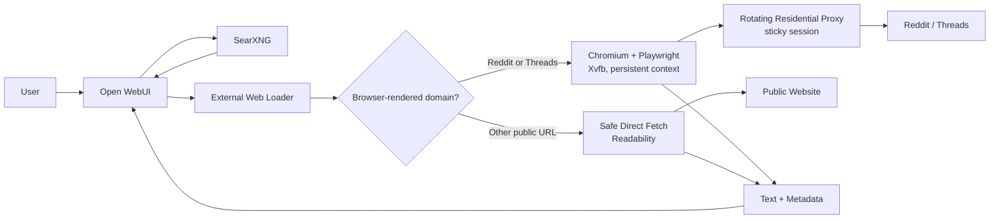

# Reddit and Threads Browser Loader for Open WebUI

An internal adapter that enables Open WebUI deployments on networks where
Reddit is blocked or unreliable to search, open, and extract Reddit content
automatically. It also supports public logged-out Threads post and series URLs
through the same browser infrastructure.

The project preserves Open WebUI's existing web-search workflow:

- SearXNG continues to discover search results.
- Reddit URLs are rendered with Chromium/Playwright through a residential
  proxy.
- Threads URLs are rendered with the same Chromium/Playwright context and
  extract visible public post, series, reply, count, and post-link content.
- Other URLs are fetched directly without consuming residential proxy
  bandwidth.
- Extracted content is returned through Open WebUI's external web-loader
  contract for model context, RAG, and citations.

The implementation has been validated with subreddit pages, posts, comments,
`redd.it` redirects, public Threads posts, public Threads series, SearXNG
results, non-social URLs, container restarts, and security controls.

## Table of Contents

- [Goal](#goal)
- [Background](#background)
- [Architecture](#architecture)
- [How It Works](#how-it-works)
- [Features](#features)
- [Repository Structure](#repository-structure)
- [System Requirements](#system-requirements)
- [Environment Configuration](#environment-configuration)
- [Installation and Deployment](#installation-and-deployment)
- [Open WebUI Integration](#open-webui-integration)
- [API Contract](#api-contract)
- [Reddit Extraction](#reddit-extraction)
- [Threads Extraction](#threads-extraction)
- [Security](#security)
- [Testing](#testing)
- [Operations](#operations)
- [Troubleshooting](#troubleshooting)
- [Backup and Recovery](#backup-and-recovery)
- [Resources and Capacity](#resources-and-capacity)
- [Experimental Findings](#experimental-findings)
- [Limitations](#limitations)

## Goal

The project is designed to provide the following Open WebUI experience:

1. A user asks a model to research a topic on Reddit or Threads.
2. SearXNG discovers relevant URLs, or the user pastes a URL directly.
3. Open WebUI sends those URLs to its external web loader.
4. The adapter opens Reddit or Threads with a browser through a residential
   proxy when browser rendering is needed.
5. The adapter extracts posts, metadata, and comments into clean text.
6. Open WebUI provides the extracted text to the model as context.
7. The model can summarize and cite browser-rendered sources without manual
   browsing.

Users can also submit Reddit URLs directly:

```text
https://www.reddit.com/r/selfhosted/
https://www.reddit.com/r/OpenWebUI/comments/...
https://redd.it/...
```

Users can also submit public Threads URLs directly:

```text
https://www.threads.com/@zuck/post/CuVY5CAvfTS
https://www.threads.com/@notarisbernada/post/DXmWPvLklc1/...
https://www.threads.net/@example/post/...
```

## Background

The original Open WebUI deployment runs on an Indonesian VPS, where direct
Reddit access is blocked or unreliable.

Routing requests through an overseas data-center VPS did not solve the
problem. Reddit returned HTTP 403 or network-security block pages for the
tested data-center IP.

A residential proxy bypassed the initial data-center block, but ordinary HTTP
clients such as `curl` still received JavaScript verification pages. A working
solution therefore requires:

- JavaScript execution;
- persistent cookies;
- a residential exit IP;
- sticky proxy sessions;
- a browser fingerprint that does not expose `HeadlessChrome`;
- DOM extraction after the page has finished processing.

## Architecture



All communication between Open WebUI, SearXNG, and `reddit-loader` takes
place on the private Docker network `owui-net`.

`reddit-loader` does not expose a public host port.

## How It Works

### Reddit requests

The browser path is used for:

- `reddit.com`;
- any `*.reddit.com` subdomain;
- `redd.it`.

Request flow:

1. Validate the URL and scheme.
2. Start or reuse a persistent Chromium context through the residential
   proxy.
3. Load the page with JavaScript enabled.
4. Block images, media, and fonts to reduce bandwidth.
5. Detect block, verification, CAPTCHA, and login pages.
6. If Reddit rejects the session, rotate the sticky-session suffix and try a
   new residential exit.
7. Attempt no more than three residential sessions per URL.
8. Extract subreddit listings, posts, and comments from the DOM.
9. Return `page_content` and `metadata` to Open WebUI.

### Threads requests

Threads support uses the same browser path and proxy configuration as Reddit.
It does not create another browser container, public port, or persistent
volume.

The browser path is used for:

- `threads.com`;
- `www.threads.com`;
- `threads.net`;
- `www.threads.net`.

Request flow:

1. Validate the requested URL is on an allowed Threads host.
2. Start or reuse the same persistent Chromium context used by Reddit.
3. Load the page with JavaScript enabled.
4. Block images, media, and fonts to reduce bandwidth.
5. Wait for meaningful visible body text, post links, or a known failure state.
6. Scroll until visible text stabilizes, bounded for small VPS capacity.
7. Validate the final URL is still on a Threads host.
8. Extract logged-out visible post, series, replies, post links, and visible
   count text.
9. Cut unrelated recommendation sections such as `Utas terkait` and
   `Related threads`.
10. Treat login walls after useful public content as non-fatal and record them
    in metadata.

The v1 Threads implementation intentionally does not log in, store Instagram
or Threads account cookies, solve CAPTCHAs, or bypass login walls. It extracts
only public content visible to a logged-out browser session.

### Other requests

Open WebUI supports one global external web-loader engine, so this adapter
also acts as a dispatcher for ordinary URLs.

For URLs that are not Reddit or Threads, it:

1. Allows only HTTP and HTTPS.
2. Rejects hosts that resolve to private or non-public addresses.
3. Pins the connection to the validated DNS result.
4. Revalidates every redirect destination.
5. Enforces a response-size limit.
6. Processes HTML with Mozilla Readability.
7. Returns JSON and plain text as normalized text.

The residential proxy is not used for this path.

## Features

- Compatible with Open WebUI's external web-loader contract.
- Batch requests of up to 20 URLs.
- Bearer-token authentication.
- Persistent browser profile and cookies.
- Sticky residential sessions with automatic rotation.
- Single-browser concurrency for small VPS deployments.
- Subreddit, post, and comment extraction.
- Support for `redd.it` short-link redirects.
- Public Threads post and series extraction.
- Threads login-wall detection without failing when useful public content was
  already extracted.
- Shared browser queue for Reddit and Threads, keeping browser concurrency at
  one.
- Detection of block, verification, CAPTCHA, and login walls.
- Image, video, audio, and font blocking.
- Safe direct fetching for non-browser-rendered sites.
- SSRF protection and DNS pinning.
- Redirect destination validation.
- Navigation and request timeouts.
- Response body size limits.
- Docker health check.
- Graceful shutdown.
- Restart-safe persistent Chromium profile.
- Structured logs without credential disclosure.
- No additional public port.

## Repository Structure

```text
.
|-- README.md
|-- compose.yaml
|-- .env.example
|-- .proxy.env.example
|-- .gitignore
`-- reddit-loader/
    |-- Dockerfile
    |-- package.json
    |-- package-lock.json
    `-- server.js
```

- `README.md`: primary project documentation.
- `compose.yaml`: integrated Docker Compose example.
- `.env.example`: template for stack secrets.
- `.proxy.env.example`: template for residential proxy credentials.
- `reddit-loader/server.js`: API, routing, browser, extraction, and security
  implementation.
- `reddit-loader/README.md`: short service-level reference for the loader
  container.
- `reddit-loader/Dockerfile`: image based on Microsoft Playwright.

## System Requirements

Validated production stack:

- Ubuntu Server 24.04 LTS;
- `x86_64` architecture;
- Docker Engine;
- Docker Compose;
- Open WebUI;
- SearXNG;
- a residential proxy with username/password authentication;
- a shared private Docker network.

The implementation was tested on:

- 2 vCPU;
- approximately 3.8 GiB usable RAM;
- 1.5 GiB swap;
- approximately 62 GB root disk.

One browser context is appropriate for this capacity. Do not raise
concurrency without measuring RAM, swap, and browser stability.

## Environment Configuration

Never commit actual secrets.

### `.env`

Used by Docker Compose:

```dotenv
WEBUI_SECRET_KEY=generate-a-strong-secret
SEARXNG_SECRET=generate-a-strong-secret
LOADER_API_KEY=generate-a-separate-strong-secret
```

Generate a secret with:

```bash
openssl rand -hex 32
```

Restrict file permissions:

```bash
chmod 600 .env
```

### `.proxy.env`

Residential proxy credentials are stored separately:

```dotenv
PROXY_HOST=proxy-provider-host
PROXY_PORT=proxy-provider-port
PROXY_USER=proxy-provider-username
PROXY_PASS=proxy-provider-password
```

Restrict file permissions:

```bash
chmod 600 .proxy.env
```

Only the `reddit-loader` container should receive this file.

### `reddit-loader` variables

| Variable | Default | Purpose |
|---|---:|---|
| `LOADER_API_KEY` | required | Bearer token for `/load` |
| `PROXY_HOST` | required | Residential proxy host |
| `PROXY_PORT` | required | Residential proxy port |
| `PROXY_USER` | required | Proxy username and sticky-session base |
| `PROXY_PASS` | required | Proxy password |
| `PORT` | `8080` | Internal service port |
| `BROWSER_DATA_DIR` | `/data/browser` | Persistent Chromium profile |
| `BROWSER_HEADLESS` | `false` | Run normal Chromium through Xvfb |
| `NAVIGATION_TIMEOUT_MS` | `45000` | Browser navigation timeout for Reddit and Threads |
| `REQUEST_TIMEOUT_MS` | `30000` | Direct HTTP request timeout |
| `MAX_RESPONSE_BYTES` | `10485760` | Maximum non-Reddit body, 10 MiB |

`BROWSER_HEADLESS=false` is important. During testing, Reddit rejected the
`HeadlessChrome` fingerprint, while normal Chromium running in Xvfb
succeeded. Threads also uses this same non-headless Xvfb browser path.

## Installation and Deployment

Example stack location:

```text
/opt/owui-stack
```

### 1. Copy the source

Expected server structure:

```text
/opt/owui-stack/
|-- compose.yaml
|-- .env
|-- .proxy.env
|-- reddit-loader/
|   |-- Dockerfile
|   |-- package.json
|   |-- package-lock.json
|   `-- server.js
|-- searxng/
`-- caddy/
```

### 2. Prepare secrets

```bash
cd /opt/owui-stack
chmod 600 .env .proxy.env
```

Ensure the `LOADER_API_KEY` in `.env` is the same token supplied to Open
WebUI.

### 3. Validate Compose

```bash
docker compose config --quiet
```

### 4. Build the loader

```bash
docker compose build reddit-loader
```

### 5. Start the loader

```bash
docker compose up -d reddit-loader
docker compose ps reddit-loader
```

Wait until its status is `healthy`.

### 6. Start or recreate Open WebUI

```bash
docker compose up -d open-webui
docker compose ps
```

### 7. Verify network isolation

```bash
docker compose ps
```

`reddit-loader` should show only `8080/tcp`, not a host mapping such as
`0.0.0.0:8080->8080/tcp`.

## Open WebUI Integration

Configure the `open-webui` service with:

```yaml
environment:
  WEB_LOADER_ENGINE: "external"
  EXTERNAL_WEB_LOADER_URL: "http://reddit-loader:8080/load"
  EXTERNAL_WEB_LOADER_API_KEY: "${LOADER_API_KEY}"
  WEB_LOADER_CONCURRENT_REQUESTS: "1"
  WEB_LOADER_TIMEOUT: "60"
```

Open WebUI should wait for the loader health check:

```yaml
depends_on:
  reddit-loader:
    condition: service_healthy
```

For web search, configure the selected Open WebUI model:

```text
Admin Panel
-> Settings
-> Models
-> Select the model
-> Model Parameters
-> Function Calling = Native
```

Enable Web Search in the chat when searching through SearXNG.

## API Contract

### Health check

```http
GET /health
```

Response:

```json
{
  "status": "ok"
}
```

### Load URLs

```http
POST /load
Authorization: Bearer <LOADER_API_KEY>
Content-Type: application/json
```

Request:

```json
{
  "urls": [
    "https://www.reddit.com/r/selfhosted/",
    "https://www.threads.com/@zuck/post/CuVY5CAvfTS",
    "https://example.com/"
  ]
}
```

Response:

```json
[
  {
    "page_content": "Readable extracted content...",
    "metadata": {
      "source": "https://www.reddit.com/r/selfhosted/",
      "final_url": "https://www.reddit.com/r/selfhosted/",
      "title": "Page title",
      "loader": "reddit-playwright",
      "post_count": 3,
      "comment_count": 0,
      "elapsed_ms": 14000
    }
  },
  {
    "page_content": "Visible Threads content...",
    "metadata": {
      "source": "https://www.threads.com/@zuck/post/CuVY5CAvfTS",
      "final_url": "https://www.threads.com/@zuck/post/CuVY5CAvfTS",
      "title": "Page title",
      "loader": "threads-playwright",
      "post_count": 0,
      "post_link_count": 23,
      "login_wall": true,
      "elapsed_ms": 19000
    }
  },
  {
    "page_content": "Example Domain...",
    "metadata": {
      "source": "https://example.com/",
      "final_url": "https://example.com/",
      "title": "Example Domain",
      "loader": "direct"
    }
  }
]
```

If one URL fails, the service still returns an entry for it:

```json
{
  "page_content": "",
  "metadata": {
    "source": "https://target.example/",
    "error": "error description"
  }
}
```

Other URLs in the batch can therefore continue processing.

## Reddit Extraction

### Subreddit pages

The adapter extracts available fields such as:

- title;
- subreddit;
- author;
- score;
- comment count;
- text body;
- permalink.

### Post pages

The primary post and available metadata are extracted from the rendered DOM.

### Comments

Loaded comments can include:

- author;
- score;
- depth;
- comment text.

Extraction is intentionally bounded to prevent uncontrolled context growth:

- up to approximately 30 posts;
- up to approximately 100 comments.

### Failure detection

A page is treated as unsuccessful when it contains signals such as:

- `Please wait for verification`;
- `You've been blocked`;
- `network security`;
- CAPTCHA;
- a login wall with very little content;
- insufficient readable page content.

For recoverable failures, the browser context is closed, the sticky session
is rotated, and the request is retried.

## Threads Extraction

Threads extraction is implemented in `reddit-loader/server.js` as a second
browser-rendered route alongside Reddit.

### Supported hosts

- `threads.com`
- `www.threads.com`
- `threads.net`
- `www.threads.net`

### Supported content

The loader extracts the public content visible to a logged-out browser:

- main post text;
- visible series or thread posts;
- visible public replies before the login wall;
- visible post links;
- visible count text such as likes, replies, reposts, quotes, or Indonesian
  equivalents when the page exposes them;
- page title and final URL.

Threads often renders useful content directly in body text without stable
`article` nodes. The extractor therefore uses a combination of DOM signals,
bounded scrolling, body text fallback, post-link discovery, and recommendation
section trimming.

### Login walls

Threads may show prompts such as:

```text
Log in to see more replies.
Log in or sign up for Threads
```

This is non-fatal when public content was already extracted. The response sets:

```json
{
  "metadata": {
    "loader": "threads-playwright",
    "login_wall": true
  }
}
```

The request fails only when the page contains no useful public post text, or
when the page appears private, unavailable, challenged, blocked, or too short
to be useful.

### Recommendation trimming

The loader trims unrelated recommendation sections from the main body, including:

- `Utas terkait`;
- `Related threads`;
- login/signup prompts after visible content.

This keeps Open WebUI context focused on the requested post or series rather
than unrelated recommendations.

### Validated Threads results

Validated on the VPS on June 26, 2026:

| URL type | Loader | Extracted chars | Notes |
|---|---|---:|---|
| Single Threads post, `@zuck` | `threads-playwright` | 4,460 | Public post and visible replies/links extracted; login wall recorded |
| Threads series, `@notarisbernada` | `threads-playwright` | 6,501 | Multi-post series extracted; `Related threads` excluded |
| Ordinary URL, `example.com` | `direct` | 127 | Direct loader still works |

The deployed container remained healthy after these tests, with observed
`reddit-loader` memory around 285 MiB on a 3.8 GiB VPS.

## Security

### Network isolation

- `reddit-loader` is connected only to `owui-net`.
- It has no public host port.
- Open WebUI consumes the endpoint from the internal Docker network.

### Authentication

`/load` requires:

```http
Authorization: Bearer <LOADER_API_KEY>
```

Requests without the correct token receive HTTP 401.

### SSRF protection

For non-Reddit URLs, the adapter rejects:

- schemes other than HTTP and HTTPS;
- URLs containing embedded credentials;
- loopback addresses;
- private networks;
- link-local addresses;
- multicast and other non-public addresses.

DNS is resolved and validated before the request, and the connection uses the
validated addresses. Redirects are handled manually and each destination is
validated again.

### Secret handling

- Secrets are not stored in the repository.
- Proxy credentials are kept in `.proxy.env`.
- The loader token is kept in `.env`.
- Both files should use mode 600.
- Structured logging filters sensitive field names.
- Do not paste container environment output into public issues or logs.

### Resource controls

- Browser concurrency: one.
- Maximum batch size: 20 URLs.
- Maximum request body: 64 KiB.
- Maximum URL length: 4096 characters.
- Default non-Reddit response limit: 10 MiB.
- Request and navigation timeouts.
- Heavy browser assets are blocked.

## Testing

### Tests through Open WebUI

#### Direct post URL

```text
Read the following Reddit page. Summarize the post and its main comments,
then include the source:

https://www.reddit.com/r/OpenWebUI/comments/1txg8yl/models_not_seeing_websearch_result/
```

#### Short URL

```text
Read this URL and explain the discussion:

https://redd.it/1txg8yl
```

#### Subreddit page

```text
Open https://www.reddit.com/r/selfhosted/ and summarize several visible
posts. Include each post's title and topic.
```

#### Search through SearXNG

```text
Find Reddit discussions about Open WebUI web search. Use Reddit sources,
summarize user opinions, and include source links.
```

#### Mixed Reddit and non-Reddit URLs

```text
Compare the content of:

https://www.reddit.com/r/selfhosted/
https://example.com/
```

#### Threads single post

```text
Buka dan rangkum isi URL Threads ini secara detail:

https://www.threads.com/@zuck/post/CuVY5CAvfTS
```

Expected result:

- the answer summarizes the public Threads post;
- the answer does not say Threads is inaccessible;
- a login wall may be mentioned, but useful public content should still be
  present.

#### Threads series

```text
Buka URL Threads ini dan rangkum semua poin penting dari utasnya. Jangan
gunakan pengetahuan umum, hanya dari isi URL:

https://www.threads.com/@notarisbernada/post/DXmWPvLklc1/langkah-detail-urus-pajak-balik-nama-waris-persiapan-dokumen-ahli-waris-warisan
```

Expected result:

- the answer includes multiple points from the series, not only the target
  post summary;
- the answer should mention topics such as SKB PPh Waris, BPHTB,
  Dispenda/Bapenda, BPN, and inheritance documents if present in the extracted
  page;
- unrelated `Related threads` / `Utas terkait` content should not be treated
  as source content.

### Internal health test

```bash
docker exec reddit-loader \
  node -e "fetch('http://127.0.0.1:8080/health').then(async r => console.log(r.status, await r.text()))"
```

### Internal loader smoke test

Run this from `/opt/owui-stack` on the VPS:

```bash
KEY=$(grep "^LOADER_API_KEY=" .env | cut -d= -f2-)

docker exec -e TEST_KEY="$KEY" reddit-loader node - <<'NODE'
const urls = [
  "https://example.com/",
  "https://www.threads.com/@zuck/post/CuVY5CAvfTS",
  "https://www.threads.com/@notarisbernada/post/DXmWPvLklc1/langkah-detail-urus-pajak-balik-nama-waris-persiapan-dokumen-ahli-waris-warisan",
];

for (const url of urls) {
  const res = await fetch("http://127.0.0.1:8080/load", {
    method: "POST",
    headers: {
      authorization: `Bearer ${process.env.TEST_KEY}`,
      "content-type": "application/json",
    },
    body: JSON.stringify({ urls: [url] }),
  });
  const [item] = await res.json();
  const content = item.page_content || "";
  console.log(JSON.stringify({
    url,
    loader: item.metadata?.loader,
    chars: content.length,
    error: item.metadata?.error || null,
    login_wall: item.metadata?.login_wall ?? null,
    contains_related_threads: /Utas terkait|Related threads/i.test(content),
  }, null, 2));
}
NODE
```

Expected high-level result:

- `example.com` uses `direct`;
- Threads URLs use `threads-playwright`;
- Threads errors are `null`;
- series extraction returns thousands of characters;
- `contains_related_threads` is `false`.

### Basic security expectations

- Missing Bearer token: HTTP 401.
- `http://127.0.0.1/...`: rejected.
- `file:///...`: rejected.
- Ordinary public URL: processed by the `direct` loader.
- Reddit URL: processed by the `reddit-playwright` loader.
- Threads URL: processed by the `threads-playwright` loader.

### Validated production results

- Subreddit page: three posts detected.
- Post page: one primary post detected.
- Comments: five comments detected.
- `redd.it`: resolved to the expected post.
- SearXNG: Reddit results discovered and fetched.
- Non-Reddit URL: Readability extraction succeeded.
- Unsafe loopback URL: rejected.
- Request without token: HTTP 401.
- Open WebUI `ExternalWebLoader`: succeeded.
- Threads single post: `threads-playwright`, 4,460 extracted characters.
- Threads series: `threads-playwright`, 6,501 extracted characters.
- Threads recommendation section: excluded from extracted content.
- `reddit-loader` restart: browser recovered successfully.
- Public Open WebUI endpoint: remained HTTP 200.
- All primary tests through the Open WebUI interface were confirmed working.

## Operations

### Container status

```bash
cd /opt/owui-stack
docker compose ps
```

### Loader logs

```bash
docker logs --since 1h reddit-loader
```

Follow logs:

```bash
docker logs -f reddit-loader
```

### Restart the loader

```bash
docker restart reddit-loader
```

The persistent profile remains reusable. On startup, the service removes
stale Chromium singleton lock files left after container recreation.

### Rebuild after source changes

```bash
cd /opt/owui-stack
docker compose build reddit-loader
docker compose up -d reddit-loader
docker compose ps reddit-loader
```

### Resource monitoring

```bash
free -h
docker stats --no-stream open-webui reddit-loader searxng caddy
docker system df
```

### Public availability

```bash
curl -I https://your-openwebui-domain.example/
```

## Troubleshooting

### Reddit blocked the current session

Example logs:

```text
Reddit blocked the current session
Reddit session rejected; rotating exit
```

Some residential exits may still be rejected. The adapter automatically
tries up to three sessions.

If this happens frequently:

1. Check residential proxy quota and service status.
2. Confirm the provider still supports the username-based sticky-session
   format.
3. Consider different country targeting.
4. Consider a higher-quality residential pool.
5. Do not immediately increase retries; doing so increases latency and
   bandwidth usage.

### `Please wait for verification`

Confirm that:

- `BROWSER_HEADLESS=false`;
- the container uses `xvfb-run`;
- JavaScript remains enabled;
- the persistent browser volume is mounted;
- the proxy is residential rather than data-center based.

### `Profile appears to be in use`

The current implementation removes these stale files:

```text
SingletonLock
SingletonCookie
SingletonSocket
```

Rebuild the image if an older deployment does not include this fix.

### Loader is healthy but Open WebUI does not use it

Inspect the Open WebUI environment:

```bash
docker exec open-webui env | grep -E \
  'WEB_LOADER_ENGINE|EXTERNAL_WEB_LOADER_URL|WEB_LOADER_CONCURRENT_REQUESTS'
```

Expected values:

```text
WEB_LOADER_ENGINE=external
EXTERNAL_WEB_LOADER_URL=http://reddit-loader:8080/load
WEB_LOADER_CONCURRENT_REQUESTS=1
```

Then recreate Open WebUI:

```bash
docker compose up -d open-webui
```

### Search finds Reddit, but content does not reach the model

Check that:

1. Web Search is enabled in the chat.
2. The selected model uses `Function Calling = Native`.
3. SearXNG returns Reddit URLs.
4. `reddit-loader` receives the requests.
5. The returned metadata does not contain an `error` field.

### Empty or insufficient content

Possible causes:

- Reddit changed its DOM structure.
- Threads changed its DOM structure or logged-out rendering behavior.
- The page requires login.
- Content had not finished loading.
- The post was removed.
- The subreddit is restricted or private.
- A new verification page is not covered by the current detection patterns.

Inspect the selectors in `reddit-loader/server.js` and the corresponding
request logs.

### Threads URL uses `direct` instead of `threads-playwright`

Confirm the host is one of:

```text
threads.com
www.threads.com
threads.net
www.threads.net
```

Then check logs:

```bash
docker logs --tail 100 reddit-loader
```

Expected successful log fields include:

```json
{
  "loader": "threads-playwright",
  "host": "www.threads.com"
}
```

If the loader is still `direct`, rebuild and recreate the loader image:

```bash
cd /opt/owui-stack
docker compose build reddit-loader
docker compose up -d reddit-loader
```

### Threads only returns one short post

Threads may lazy-render additional series content. The current extractor scrolls
until body text stabilizes, but logged-out visibility can still vary by URL,
region, session, and Threads product changes.

Check:

1. `docker logs --tail 100 reddit-loader` for `chars`.
2. Whether `login_wall` is `true`.
3. Whether the URL is a public post or series and not private, deleted, or
   unavailable.
4. Whether `contains_related_threads` remains false in the smoke test.

### High memory or swap usage

Do not raise concurrency. Restart the loader if browser memory continues to
grow:

```bash
docker restart reddit-loader
```

Monitor:

```bash
free -h
docker stats reddit-loader
```

## Backup and Recovery

Before modifying Compose:

```bash
cd /opt/owui-stack
timestamp=$(date +%Y%m%d-%H%M%S)
mkdir -p backups
cp -a compose.yaml "backups/compose.yaml.$timestamp"
cp -a .env "backups/env.$timestamp"
chmod 600 "backups/env.$timestamp"
```

Preserve:

- `compose.yaml`;
- the `reddit-loader` source;
- `.env`;
- `.proxy.env`;
- the `reddit-browser-data` volume if browser cookies should survive;
- the Open WebUI data volume;
- SearXNG configuration;
- reverse-proxy configuration.

Never place `.env` or `.proxy.env` in a publicly readable backup.

## Resources and Capacity

Observed memory usage after deployment:

| Component | Approximate RAM |
|---|---:|
| Open WebUI | 798 MiB |
| Reddit loader with active Chromium | 481 MiB |
| SearXNG | 157 MiB |
| Caddy | 15 MiB |

At the time of measurement:

- approximately 2.1 GiB memory remained available;
- approximately 43 MiB of 1.5 GiB swap was in use.

These are snapshots, not fixed requirements. Actual usage depends on
embedding models, request volume, Reddit pages, browser lifetime, and other
services.

Recommendations:

- keep concurrency at one;
- do not add another browser service without profiling;
- monitor swap usage;
- remove old Docker images carefully when disk space becomes limited;
- measure residential bandwidth before increasing web-search result counts.

## Experimental Findings

The following approaches were tested but did not solve the problem.

### Direct access from an Indonesian VPS

Reddit was blocked or unreliable.

### Overseas data-center VPS

The tested data-center IP could reach Reddit's network but received HTTP 403
for the home page, subreddits, posts, short links, and JSON endpoints.

Conclusion: overseas data-center egress alone is insufficient.

### Jina Reader

The wrapper endpoint returned HTTP 200, but its document reported that Reddit
itself returned HTTP 403.

Conclusion: HTTP 200 from a wrapper does not prove that Reddit content was
retrieved.

### Free data-center proxy

The proxy worked, but Reddit displayed:

```text
You've been blocked
network security
```

### Residential proxy with an HTTP client

The residential proxy bypassed the initial data-center block, but `curl`
received a JavaScript verification page or HTTP 403.

Conclusion: a residential IP is necessary but not sufficient. JavaScript,
cookies, and a browser context are also required.

### Headless browser fingerprint

During deployment, Chromium headless shell exposed a `HeadlessChrome`
fingerprint and Reddit rejected it. Non-headless Chromium inside Xvfb
succeeded.

This is why the image starts with:

```dockerfile
CMD ["xvfb-run", "-a", "node", "server.js"]
```

## Limitations

- Success still depends on residential proxy quality.
- Reddit may change its anti-bot flow or DOM structure.
- Not every comment is necessarily loaded on the initial page.
- Very large threads are not extracted in full.
- Private, quarantined, age-restricted, or login-only communities may fail.
- Browser extraction is slower than ordinary HTTP fetching.
- A first request may take approximately 10-20 seconds.
- Session rotation adds latency.
- Residential bandwidth has a cost.
- The adapter is not intended for large-scale crawling. It is deliberately
  limited for low-volume Open WebUI use.

## Status

Status as of June 26, 2026:

- deployed;
- healthy;
- integrated with Open WebUI;
- user-interface tests passed;
- Reddit, Threads, and direct URL routing passed;
- Threads single-post extraction passed;
- Threads series extraction passed;
- Threads login wall handled as non-fatal after useful public content;
- Threads recommendation trimming passed;
- basic security checks passed;
- restart recovery passed.

Recommended follow-up work:

1. Monitor block rate, latency, bandwidth, RAM, and swap.
2. Review logs regularly.
3. Update selectors if Reddit or Threads changes its DOM.
4. Upgrade Open WebUI and Playwright in a controlled manner.
5. Retire or repurpose any unused egress VPS.

## Security Notice

This repository and its documentation must never contain:

- private SSH keys;
- passwords;
- real API keys;
- actual proxy credentials;
- Open WebUI secrets;
- session tokens;
- authenticated browser cookies.

Use placeholders in documentation and keep secrets only in restricted
environment files on the server.
